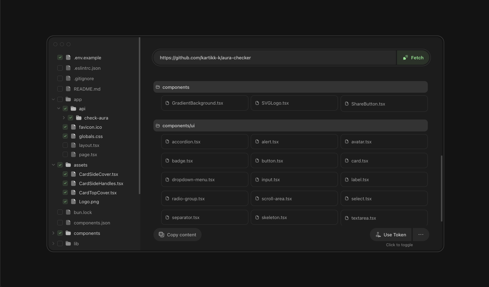

# RepoChat
Context for LLMs directly from GitHub repositories.

### Preview


## Project Structure
- `src/app` – Next.js routes, layouts and global styles
- `src/components` – Reusable React components and UI primitives
- `src/helpers` – Helper functions for GitHub requests and folder parsing
- `src/lib` – Additional utility functions
- `src/store` – Zustand store for client side state
- `public` – Static assets served directly by Next.js

Configuration files worth noting:
- `next.config.ts` – Next.js configuration
- `postcss.config.mjs` – Tailwind CSS/PostCSS setup
- `tsconfig.json` – TypeScript configuration

## Local Setup
1. Install dependencies
   ```bash
   npm install
   ```
2. Start the development server
   ```bash
   npm run dev
   ```
   Then open [http://localhost:3000](http://localhost:3000) in your browser.

For a production build run `npm run build` followed by `npm start`.
